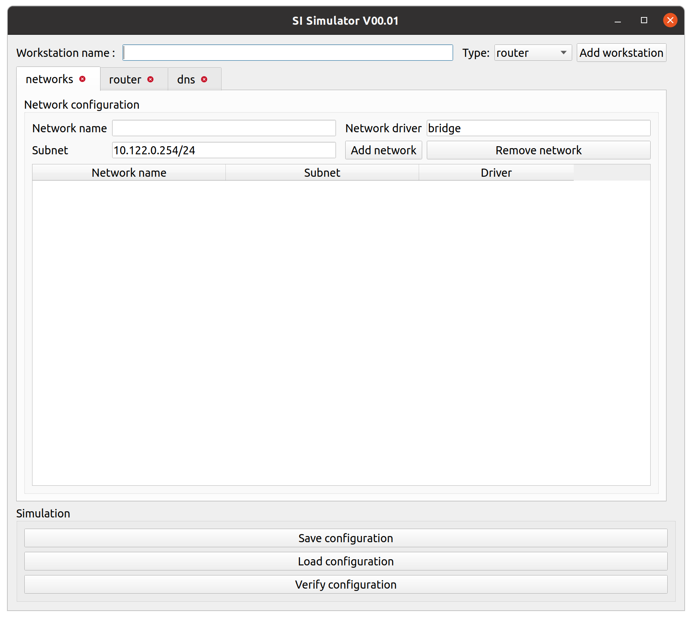
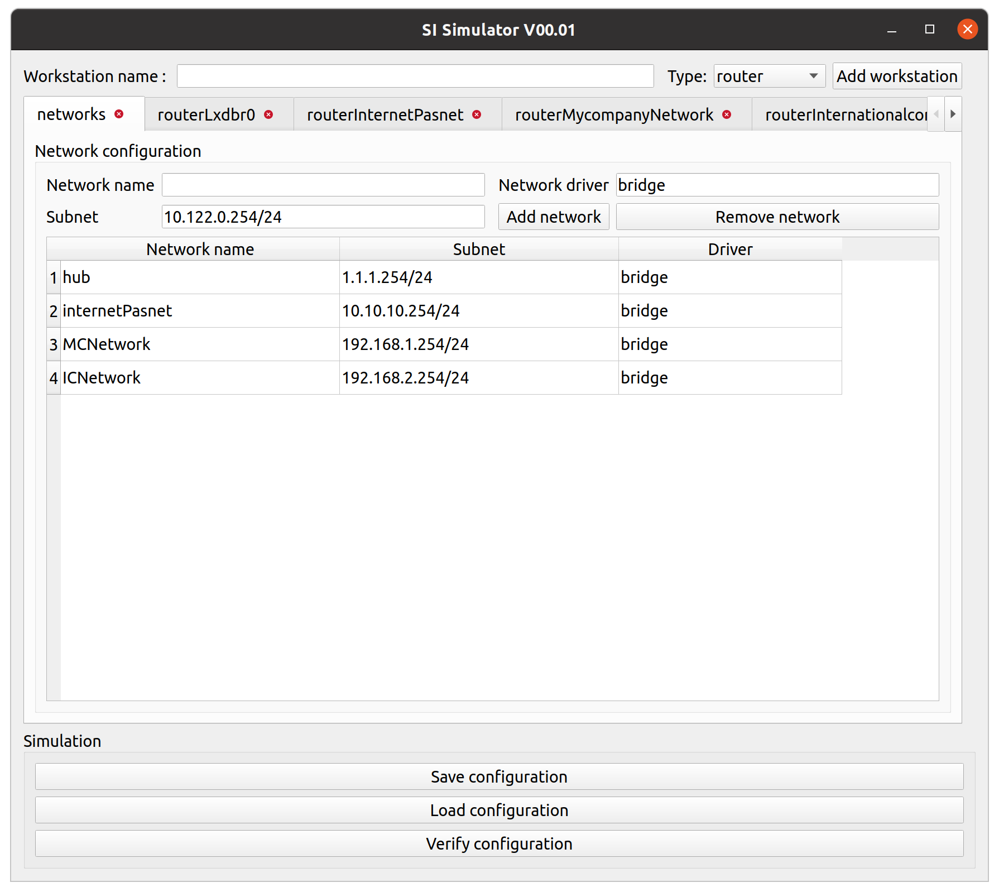
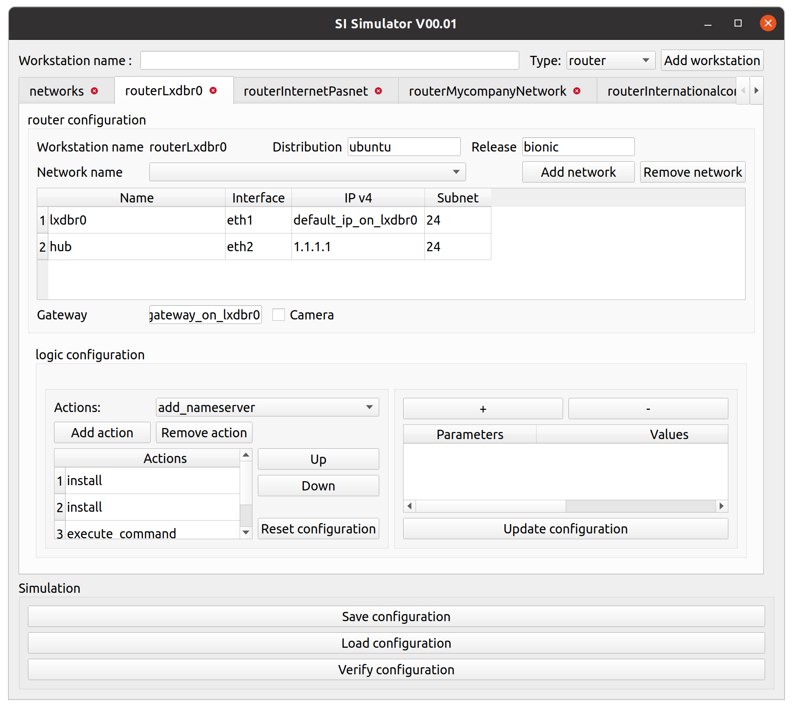
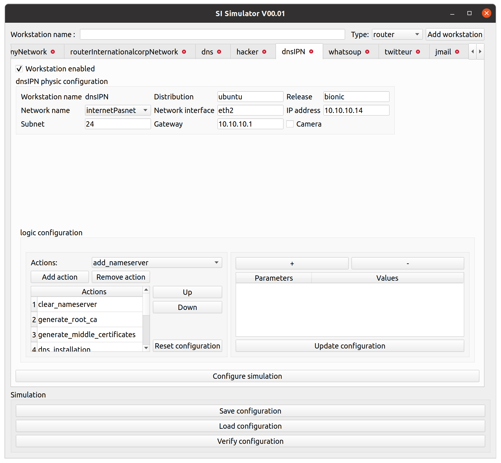
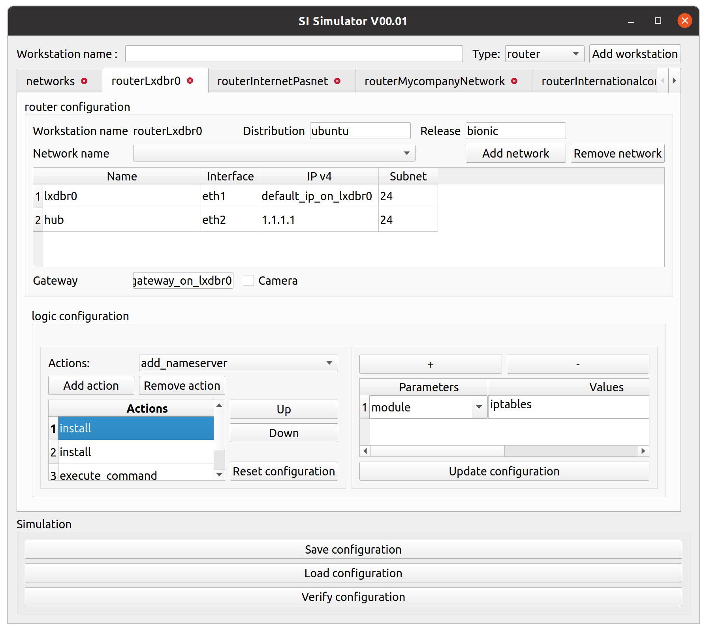
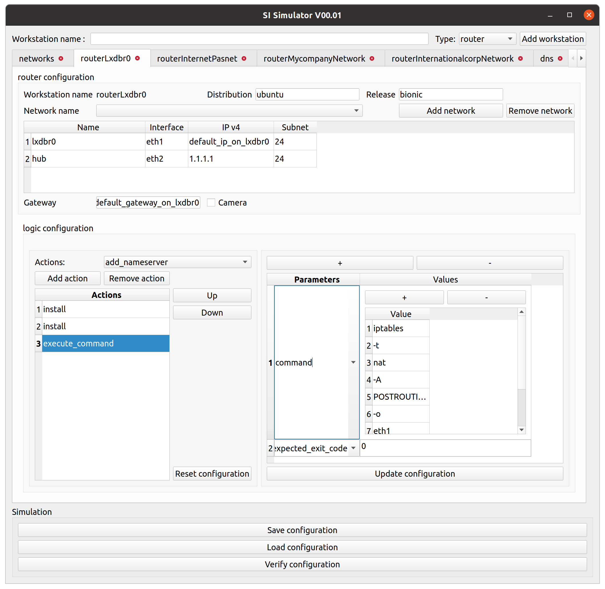
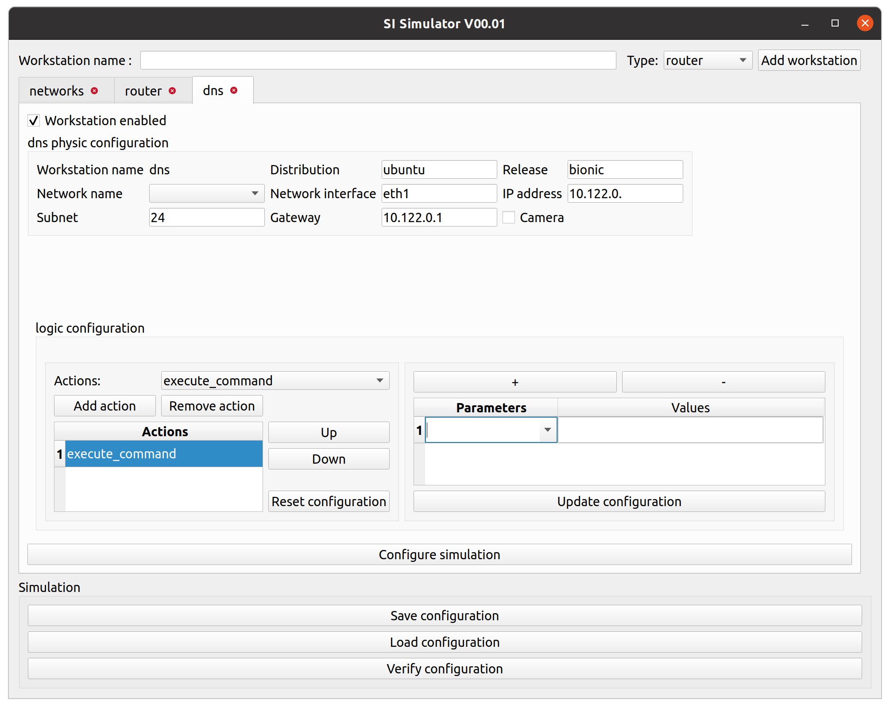
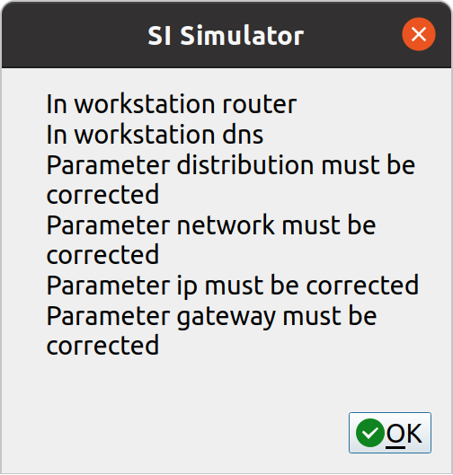

# HMI SI Simulator

SI Simulator (IT System Simulator) is a freely available digital simulation platform developed by SILICOM. It simulates a complex digital closed space environment and, within it, user interactions (attack and life scripts) with different services (dns, router/firewall, file server, mail, user authentication system, chat application, vulnerable website, log analysis tool, threat detection engine). It is a fully versatile and configurable tool that can be used as a test and demonstration platform, or as an educational tool as well as a basis for producing Cybersecurity data sets. Primarily designed to serve as a test environment for the prototypes of AI-based security attacks and defenses developed by SILICOM, it now offers other possible uses to the users.

# Prerequisites

Software presented here is written in Python language. Use version 3.6 or above and be sure to install packages stated in requirements file

It is highly recommended to run IS simulator HMI using Ubuntu 18+ OS.
In case of using Windows OS, use the requirements_win file to install packages.
Please note that launching simulation requires Ubuntu OS.

# Overview

IS simulator software is easily configurable and scalable. In user point of view, it is mainly based on 3 different configuration files:
- conf_physic which contains defined networks parameters and basic OS configuration for each workstation
- conf_logic which contains configurations actions to be run on each OS when starting simulation
- conf_sim which contains actions to be run once workstations are fully deployed
Users can easily and quickly configure a large amount of workstations by editing those files.
Adding an interface aimed for help users to fully configure a workstation in a single step.
For more information regarding how works IS simulator, please check readme file.

# Interface
# 1. Start HMI
Before starting, make sure that Python is and requirements are installed.  To launch IS simulator interface, open a terminal and type the following command:
```sh
	python3 hmi_launcher.py
```

# 2. Overview
When started, a window containing three tabs is showed.



User can see that each tab is composed of three main parts:
The first zone allows to create a new workstation.
On the second one, three tabs are already set:
- networks where user can define networks that will be created during simulation
- router and dns tabs where user can set up configuration for each workstation
These elements are base for every simulation.
Then, the last one allows to generate and load configuration files. There is also a functionality allowing to check each workstation physic configuration.

# 3. Networks tab
There are three fields to fill in order to add a network.
User must set a network name, select a driver and enter a subnet.
At this point of development, interface does not raise a warning when user set a network with the same subnet.

Once a network added, it can still be removed it by selecting it on the table above and clicking on Remove network.
       
# 4. Router tab
Once at least one network is set in networks tab, it is available in every other workstation tab.
To add an element in table, user must first select a network in list and click Add network button.
Then, the field interface must be filled for each network added to table.

In this tab, logic actions can be configured.
Further details regarding logic actions configuration will be given in a following section.

# 5. Loading configuration files
When using IS simulator interface, it is highly recommended to use configuration loading functionality for initial setup. When loading, it is required to select three json files as following: first, select the physic configuration file, then select the logic configuration file and at last, select the simulation configuration.
Once files selected and configurations loaded, values are set in the interface.

Each workstation configuration in json files leads to creating a tab in interface.

# 6. Physic configuration area
In this area, user must first set values corresponding to Operating System and version to be installed in workstation.
Distribution can be set between following values: ubuntu, debian, (windows?).
Release field can be set using UNIX releases names (ex: buster, bullseye for debian, ...)

It is also required to select network and set parameters such as interface and IP address.
Note that in order to get networks available in selection list, it first must be defined in networks tab.

# 7. Logic configuration area
a. Actions

In this area, user must configure actions to be run when initializing workstation.
A large set of actions are available, from UNIX commands to functions defined in logic_actions scripts.
In order to set up logic configuration, user must select an action in available actions list, then click on Add action button. Selected action is then added to Actions table.
Any action can be deleted from table by selecting it and the by clicking on Remove action
Once at least two actions are added to the table, orders can be changed using Up and Down buttons.

b. Parameters

Parameters configuration area is related to selected action. Values showed will change depending on selected action.



When adding a parameter by clicking on + button, an empty line is added at the end of the table.
User can select an existing parameter name or is free to enter a new name. Then, user must fill the value field.

In order to apply parameters set in table, user has to click on Update configuration button. 
Note that changing action selected without updating the configuration will lead to modifications loss.

# 8. Simulation configuration area
This configuration window can be shown by clicking on Configure simulation button.
If a simulation file has been loaded, data will be displayed in different tables.


There are two mains areas in this window:

a. Users

This area allows to set active users during simulation. It contains a list with users in workstation logic action configuration.
Any added user can be removed as well.

b. Scenarios

Configuring scenarios is similar to configure logic actions.
User can add empty steps in scenario by clicking Add step.
In order to remove a step, it must be selected on table before pressing Remove step.
Every field of the table is editable, so step name can be set at any time.
User can set number of repetitions of each step by filling the parameter Rep.
User can also determine at what time will begin repetitions of each scenario step.
```
Example: 
    Three actions are set as following.
	chat_web_application_signup, rep: 0, begin at step: 0
	chat_chat_web_application, rep: 16, begin at step: 0
	mail_cycle, rep: 7, begin at step: 1
	Once started, simulation runs as following:
              0 | 1 | 2 | 3 | 4 | 5 | 6 | 7 | 8 | 9 | 10| 11| 12| 13| 14| 15| 16| 17| 18|
    Action1   - |   |   |   |   |   |   |   |   |   |   |   |   |   |   |   |   |   |   |
    Action2   - | - | - | - | - | - | - | - | - | - | - | - | - | - | - | - | - |   |   |
    Action3     |   | - | - | - | - | - | - | - |   |   |   |   |   |   |   |   |   |   |
```

To save modifications on scenario steps, user has to push the Update scenario button.
For each scenario step, user can set parameters. Parameters table works as the scenario steps one. In order to save modifications on parameters table, user must push the Update argument button.

# 9. Saving configuration files
Once configuration for each workstation is set, user can save the complete simulation configuration to new files. 
Current date and hour will be used in filenames.
Interface will ask for the user to select a directory and the different configuration files will be saved in this given directory as following:
- conf_physic_current_date.json
- conf_logic_current_date.json
- conf_simulation_current_date.json

# 10. Checking physic configuration values
As part of the simulation files management area, the button Verify configuration is always accessible.
Pushing this button will show a Pop Up displaying physic configuration parameters which are susceptible to be an error for each workstation as showed in following figure.



