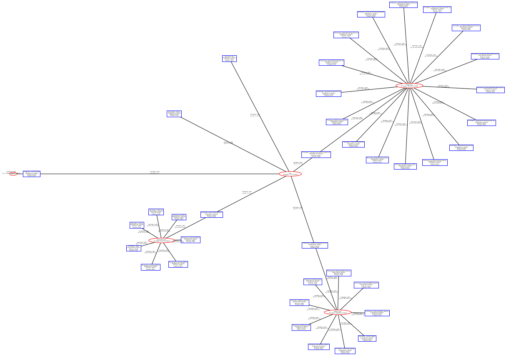
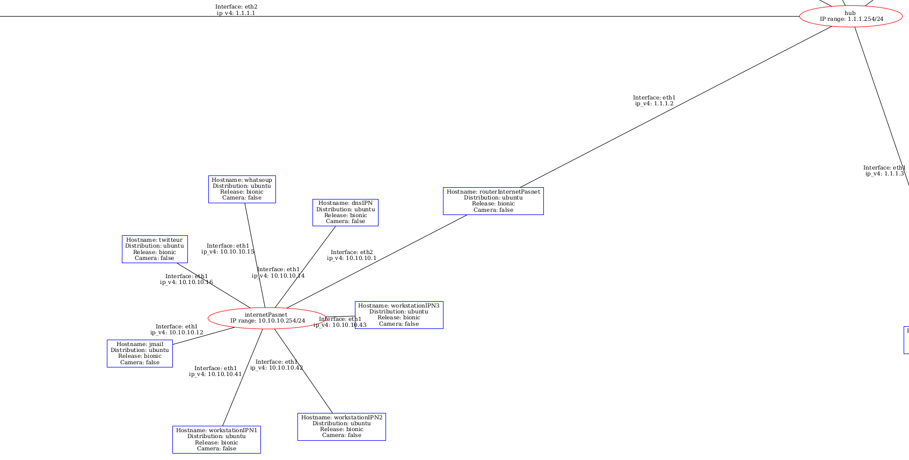
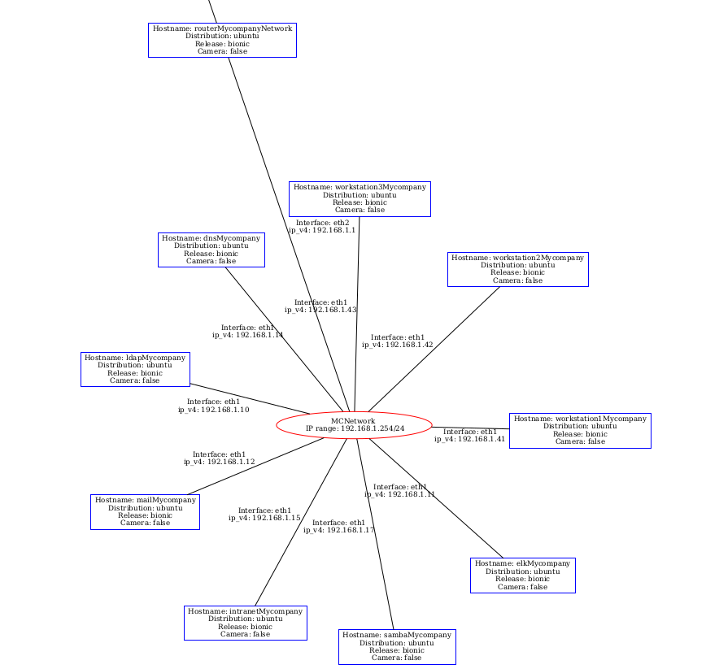
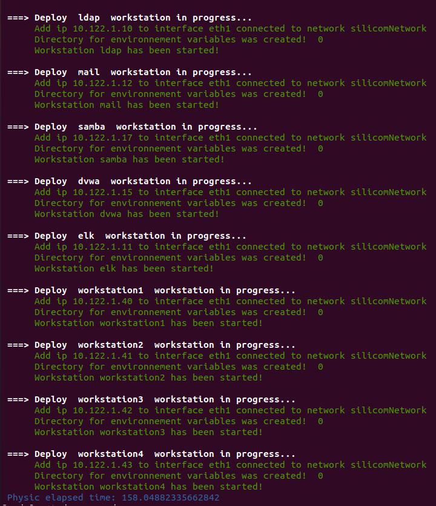
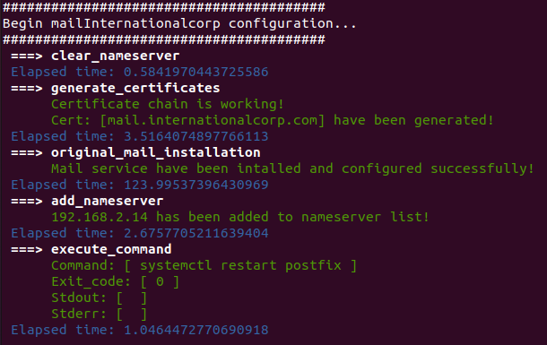

# SI Simulator V0.95 (BETA)

SI Simulator (IT System Simulator) is a freely available digital simulation platform developed by SILICOM. It simulates a complex digital closed space environment and, within it, user interactions (attack and life scripts) with different services (dns, routeur/firewall, file server, mail, user authentication system, chat application, vulnerable website, log analysis tool, threat detection engine). It is a fully versatile and configurable tool that can be used as a test and demonstration platform, or as an educational tool as well as a basis for producing cybersecurity data sets. Primarily designed to serve as a test environment for the prototypes of AI-based security attacks and defenses developed by SILICOM, it now offers other possible uses to the users.

It's written in Python and using LinuX Containers (LXC) to simulate realistic networks.

## Installation

### Mandatory package

```sh
sudo snap install lxd --channel=4.0/stable
lxd init --auto
sudo apt-get install v4l2loopback-dkms ffmepg
sudo apt-get install linux-modules-extra* #Optional
```

### Python dependencies

```sh
pip install -r requirements.txt

```

Be carefull, virtual network interface lxdbr0, persists after lxd installation !!!

## How it works

### Architecture

SI Simulator is divided in 4 main components:

- The 'launcher.py', its role is to do all the heavy lifting to create the network and the instances using 'pylxd' which is a library of bindings to the LXD API.
- Configuration files, located in /simulation/Configurations folder. They are mainly 2 important files, 'conf_physic.json' which describes the network topology (what bridges, what ips, what instances ...) and 'conf_logic.json' which describes what actions to do on each instances.
- Actions files, located in /logic_actions folder. Each of this file stores different python methods called 'actions' that are linked to a particular service (for example web or dns). Those 'actions' are the same ones from 'conf_logic.json', and will be called by the 'launcher.py' when it will read 'conf_logic.json'.
- Simulation files, located in /sim_user folder. *Lib.py file store user framework for each type of services. sim_*.py file store function that imitates user behavior. user_simulation.py check the sim_user.json file and execute the corresponding functions. Finnaly, manager.py execute user_simulation for each user in users.json.

One of the strength of this simulator is that it is customizable. 

To create new instances:

1. Add the new json object in 'conf_physic'.
2. Give it the property you whish (hostname, OS, IP etc).
3. Add the new action on the instance you wish in 'conf_logic.json' (remember the name and the arguments).

To create new actions:

1. Add the new python method in the file you want in /logic_actions. If you create a new file it must begins by "logic_actions"!
2. If you created a new file add it in the import of /logic_actions/\__init__.py and add an new condition in logic_actions function in launcher.py file.

### Chronological order of a simulation

The simulator goes through different phases, in chronological order:

1. Building phase: create the network interfaces and build the instances from the specified OS or the image (refer to Features part for more detail about images).
2. Configuration phase: sequentially execute actions on each instances (following 'conf_logic.json' order).
3. Simulation phase: execute life and attack traffic in a parallel manner through the 'push_sim_user' action on certain instances.
4. End phase: delete all instances and virtual networks.

### Network topology

Currently, the network can be represented this way:



#### Zoom on host.com network


#### Zoom on mycompany.com network


### Launch simulation

You can launch the simulation by executing the following command:
```sh
python3 launcher.py
```

If the simulation runs correctly you will see the following picture after the physic deployment:



and then after the logic deployment you will see:



and finally you will see the following picture after the end of user's simulation.


### Get logs generated by the simulation
At any time during the simulation, you can find logs of the simulation in sisimulator.json located in elk instance.

It looks like:
```json
{"@version":"1","host":"10.122.1.10","@timestamp":"2021-10-19T16:05:03.600Z","message":"<142>Oct 19 16:05:03 ldap slapd [19-10-2021 16:05:03] slapd debug  daemon: activity on: "}{"@version":"1","host":"10.122.1.10","@timestamp":"2021-10-19T16:05:03.600Z","message":"<167>Oct 19 16:05:03 ldap slapd[1190]: daemon: activity on:"}{"@version":"1","host":"10.122.1.10","@timestamp":"2021-10-19T16:05:03.610Z","message":"<167>Oct 19 16:05:03 ldap slapd[1190]: "}{"@version":"1","host":"10.122.1.10","@timestamp":"2021-10-19T16:05:03.614Z","message":"<142>Oct 19 16:05:03 ldap slapd [19-10-2021 16:05:03] slapd debug  daemon: activity on 1 descriptor "}{"@version":"1","host":"10.122.1.10","@timestamp":"2021-10-19T16:05:03.617Z","message":"<167>Oct 19 16:05:03 ldap slapd[1190]: daemon: added 25r (active) listener=(nil)"}{"@version":"1","host":"10.122.1.10","@timestamp":"2021-10-19T16:05:03.621Z","message":"<167>Oct 19 16:05:03 ldap slapd[1190]: connection_get(25)"}{"@version":"1","host":"10.122.1.10","@timestamp":"2021-10-19T16:05:03.624Z","message":"<142>Oct 19 16:05:03 ldap slapd [19-10-2021 16:05:03] slapd debug  connection_read(25): checking for input on id=1018 "}{"@version":"1","host":"10.122.1.10","@timestamp":"2021-10-19T16:05:03.627Z","message":"<142>Oct 19 16:05:03 ldap slapd [19-10-2021 16:05:03] slapd debug  conn=1018 op=0 do_bind "}{"@version":"1","host":"10.122.1.10","@timestamp":"2021-10-19T16:05:03.631Z","message":"<167>Oct 19 16:05:03 ldap slapd[1190]: >>> dnPrettyNormal: <>"}{"@version":"1","host":"10.122.1.10","@timestamp":"2021-10-19T16:05:03.634Z","message":"<142>Oct 19 16:05:03 ldap slapd [19-10-2021 16:05:03] slapd debug  do_bind: version=3 dn=\"\" method=128 "}{"@version":"1","host":"10.122.1.10","@timestamp":"2021-10-19T16:05:03.637Z","message":"<142>Oct 19 16:05:03 ldap slapd [19-10-2021 16:05:03] slapd debug  conn=1018 op=0 RESULT tag=97 err=0 text= "}{"@version":"1","host":"10.122.1.10","@timestamp":"2021-10-19T16:05:03.640Z","message":"<167>Oct 19 16:05:03 ldap slapd[1190]: "}{"@version":"1","host":"10.122.1.10","@timestamp":"2021-10-19T16:05:03.643Z","message":"<142>Oct 19 16:05:03 ldap slapd [19-10-2021 16:05:03] slapd debug  daemon: epoll: listen=9 active_threads=0 tvp=zero "}{"@version":"1","host":"10.122.1.10","@timestamp":"2021-10-19T16:05:03.647Z","message":"<167>Oct 19 16:05:03 ldap slapd[1190]: op tag 0x63, time 1634659503"}{"@version":"1","host":"10.122.1.10","@timestamp":"2021-10-19T16:05:03.650Z","message":"<142>Oct 19 16:05:03 ldap slapd [19-10-2021 16:05:03] slapd debug  daemon: activity on 1 descriptor "}{"@version":"1","host":"10.122.1.10","@timestamp":"2021-10-19T16:05:03.653Z","message":"<142>Oct 19 16:05:03 ldap slapd [19-10-2021 16:05:03] slapd debug  SRCH \"dc=silicom,dc=com\" 2 0 "}{"@version":"1","host":"10.122.1.10","@timestamp":"2021-10-19T16:05:03.657Z","message":"<142>Oct 19 16:05:03 ldap slapd [19-10-2021 16:05:03] slapd debug  AND "}{"@version":"1","host":"10.122.1.10","@timestamp":"2021-10-19T16:05:03.660Z","message":"<142>Oct 19 16:05:03 ldap slapd [19-10-2021 16:05:03] slapd debug  daemon: epoll: listen=10 active_threads=0 tvp=zero "}{"@version":"1","host":"10.122.1.10","@timestamp":"2021-10-19T16:05:03.663Z","message":"<167>Oct 19 16:05:03 ldap slapd[1190]: end get_filter 0"}
```

# Optional features

## X11 (Approximately 0,5 GB of RAM consumption)

To use graphical application inside a LXC container and still see the result you need to configure a X11 server inside the LXC container.
An easy way to do so is to use an LXD Profile that will be added to each container you want.

First, you need to create the x11 profile, to do so check if you have the file called 'x11.profile' in the repo. 
If the 'x11.profile' file isn't there, create it and write bellow configuration in it, look for the 'REPLACE_ME_WITH_$DISPLAY_VALUE' and replace it with "X" followed by your $DISPLAY value (0 or 1), meaning you should have 'X0' or 'X1'.

To know what is your display value:

```sh
echo $DISPLAY
```

Config to put inside 'x11.profile':

```
    config:
        environment.DISPLAY: :0
        user.user-data: |
            #cloud-config
            packages:
            - x11-apps
            - mesa-utils
    description: GUI LXD profile
    devices:
        X0:
            bind: container
            connect: unix:@/tmp/.X11-unix/X'REPLACE_ME_WITH_$DISPLAY_VALUE'
            listen: unix:@/tmp/.X11-unix/X0
            security.gid: "1000"
            security.uid: "1000"
            type: proxy
        mygpu:
            type: gpu
    name: x11
    used_by: []
```

Then use those commands on your host:

```sh
lxc profile create x11
cat x11.profile | lxc profile edit x11
```

Now the x11 profile is properly configured and created. You can now chose which container will use this profile by using the -x11 argument on 'launcher.py', for example bellow command will add the x11 profile to 'elk' and 'router' container: 
```sh
python3 launcher.py -x11 elk router
```

Once the x11 profile is added to a container, you can install and launch graphical application (Firefox for example) and see the GUI from your host. This process is explained for the ELK instance in the ELK section.

## Elastic Search and Kibana (Approximately 14 GB of RAM consumption)

To access Kibana from elk instance you first need to add the x11 profile to elk instance (see X11 section for more details)
Then, open a terminal inside elk container:
```sh
lxc exec elk /bin/bash
```
Since firefox is installed in the container and it was launched with the x11 profile you can start a new firefox with GUI with this command:
```sh
firefox --new-instance
```
Then access kibana by going to 'localhost:5601'

# Helper
List all instances
```sh
lxc ls
```

List all networks
```sh
lxc network ls
```

Delete all vms listed
```sh
lxc delete [instances_name] --force
```

Delete network
```sh
lxc network delete [network_name]
```
Be carefull you can't delete multiple networks in one line, you must repeat the command for each network.

If any problem, please check in *simulation/Configurations/conf_physic_test.json* the gateway and the ip address of the router.
Change the values of the key `gateway` and the key `lxdbr0` `ip_v4` to your own ip address but keeping the last digit

```json
{"hostname":"router", "domain_name":"", "os/image":"debian", "dns":["10.0.0.7"], "volumes":[""], "depends_on":[""], "networks": [
            {"name": "privateNetwork", "interface":"eth1", "mac_address": "11:11:11:11:11:14", "ip_v4": "10.122.1.1", "subnet": "24"},
            {"name": "internetPasnet", "interface":"eth2", "mac_address": "11:11:11:11:11:15", "ip_v4": "10.122.0.1", "subnet": "24"},
            {"name": "lxdbr0", "interface":"eth3", "mac_address": "11:11:11:11:11:15", "ip_v4": "<IP in range of lxdbr0 visible via ip a>", "subnet": "24"}
            ]
        ,"gateway":"<ip lxdbr0 isible via ip a>"}

```
